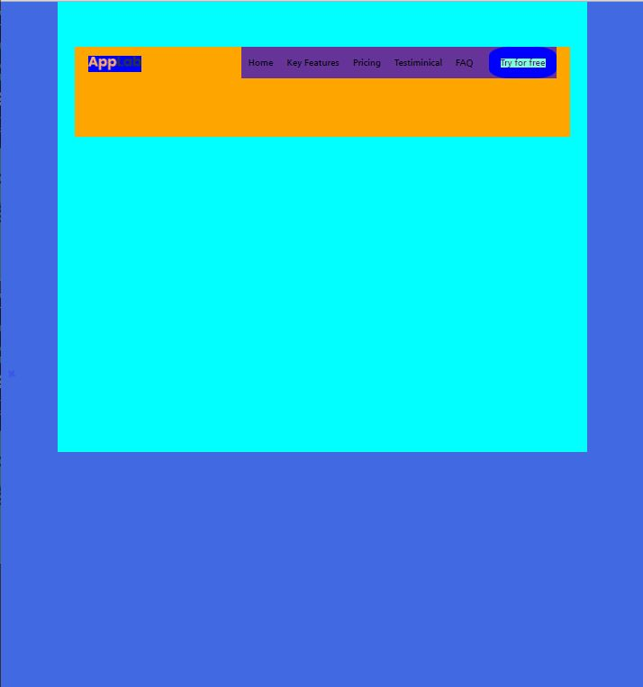
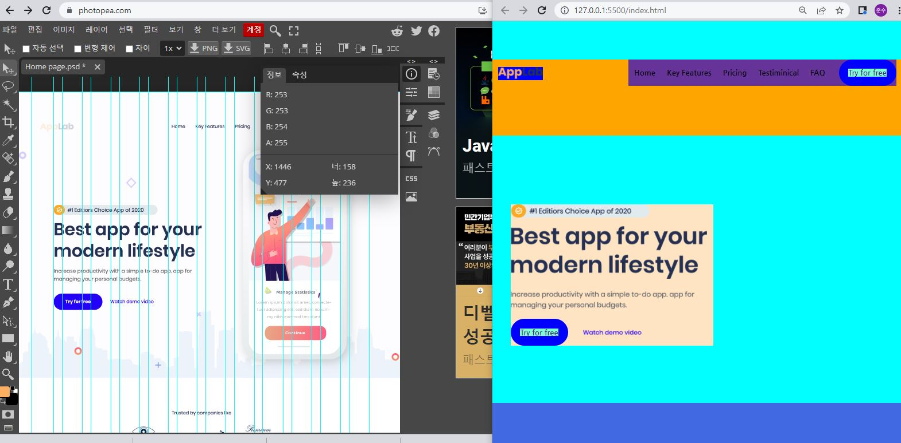
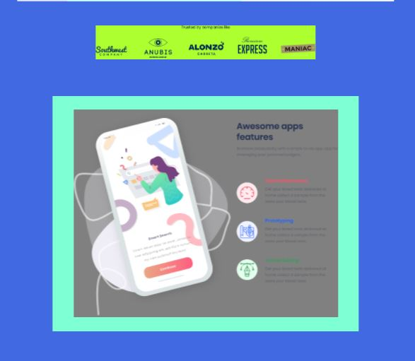

# AppLab

AppLab 랜딩 페이지(홈페이지)를 만든 프로젝트입니다.   
디자이너분들이 무료로 제공하는 디자인 시안을 이용해 만들었습니다.  

[DEMO](https://singular-shortbread-f5b80f.netlify.app/)  

## pictures

## 프로젝트의 주안점
1. HTML & CSS 역량을 보여줄 수 있는 프로젝트를 하자
2. 웹디자인 시안을 받고 그대로 만들어보자.
3. 최대한 HTML & CSS 기술을 많이 녹여보자.

## 포토비
디자이너의 시안이 psd 파일이었고 저의 데스크탑에는 포토샵이 안깔려있습니다. 
이걸 위해 어떤 프로그램을 새로 설치하는데 부담감이 있어 가볍게 사용할 수 있는 
웹 서비스인 포토비를 이용하였습니다. 
이때 포토비에서 크게 두가지 기능을 알아내는점이 어려웠는데 
1. 레이러를 따로 추출하는 법
2. 각 레이어들의 픽셀 위치 찾기 

## header
header 부분을 짜는데 당장 헤더의 탑부분을 가운데 정렬하는데만 시간이 꽤 소요됐다. 
전에 스타벅스 클론코딩할때는 더 어려운것도 아무 자료없이 쉽게 했었는데 
클론코딩과 실제 내가 설계하는 것은 확실히 다르다. 

## box model
박스모델은 처음부터 잘 짜야 한다는 생각을 했다. 
특히 항상 주의할 점은 박스에서의 위치를 잡을때 항상 width와 height를 염두해둘것이다. 

## 실수1 
top을 만들고 right:0을 해도 오른쪽으로 가지 않았던 것은 저장이 확실하게 안되어 반영되지 않았기 때문이다. 
저장과 확인을 잘 해야한다. 

## 실수2
ul.homekey의 서브메뉴들을 flex해서 가로정렬해야하는데 
나는 그 homekey를 flex하지 않고 그 부모요소인 menuBox만 flex해서 계속 왜 안나오나 생각했다...  
단순 선택자 문제였는데 어쩐지 백그라운드 컬러도 이상했다.  
알고나니 진짜 허탈하다. 

## 회전메뉴
그냥 정적이면 너무 액션이 없으니 돌아가는 메뉴를 하나 만들어 보려고했다.  
여기서 어려웠던점이 하나의 그룹으로 두개의 매뉴를 감싸는건데 머리로는 분명 이해했던 내용이었는데  
실제로 하려고하니 이상하게 자꾸 두개의 그룹을 따로따로 움직이려 했다. 
무의식중에 귀차니즘이 발동한 것 같다. 
새롭게 섹션그룹을 만들어주고 그 안에 두개의 메뉴를 넣어 hover 기능으로 처음부터 다시 구현했다. 
키포인트는 hover를 맨 끝의 두개의 메뉴가 아닌 메뉴를 묶은 섹션그룹에 주어야 한다는 점이다..  
알고나면 쉽지만 실제로 구현할때는 떠오르기 쉽지 않았다.. 

## 이미지 이름
이미지 중 하나의 이미지가 계속 안나왔다. 
이미지를 삽입하면 아주 조금 자리를 차지하는것같아 사이즈를 늘려보고 
z-index를 99로 주기도 해봤지만 변화가 없길래 뭔가 했는데 
알고보니 파일명에 '#'이 들어가서 였다 해결되어서 다행이다. 
